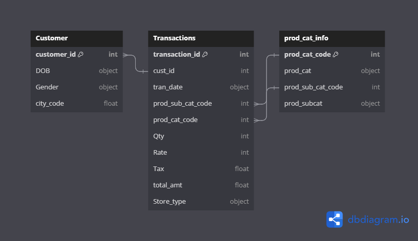
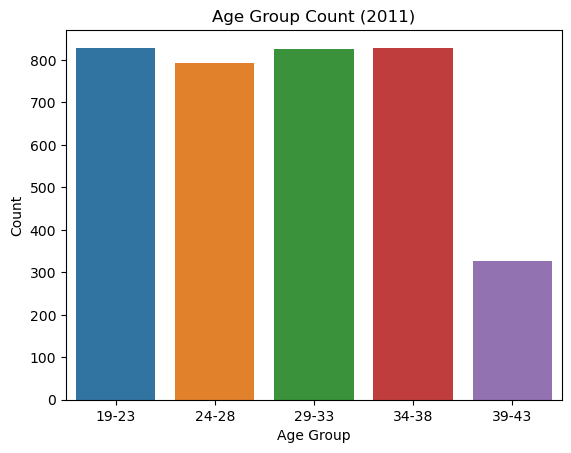
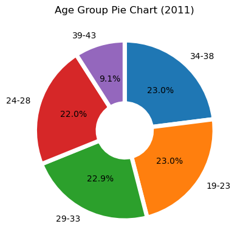
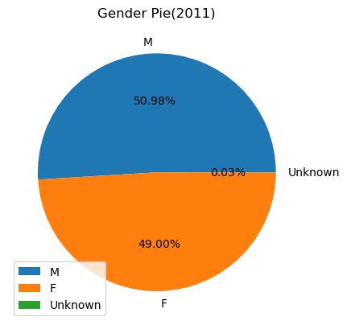
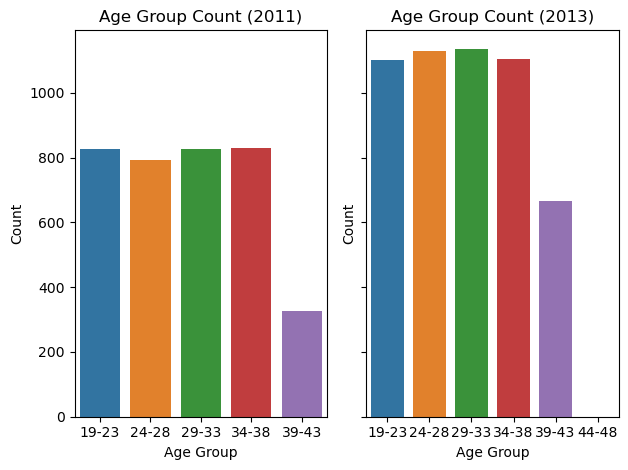
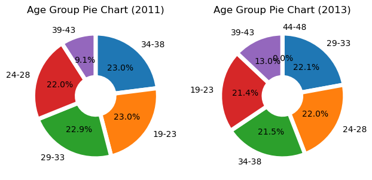
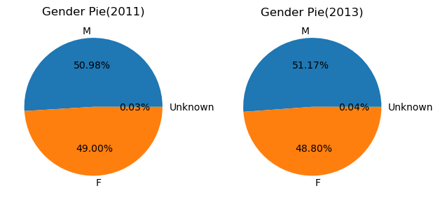
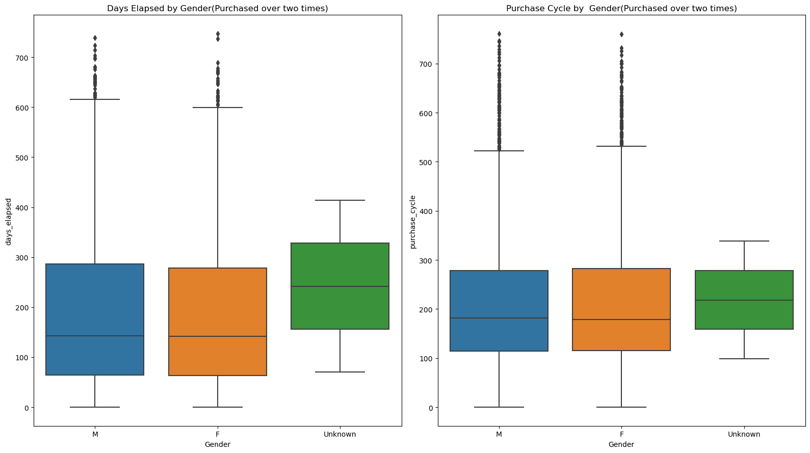
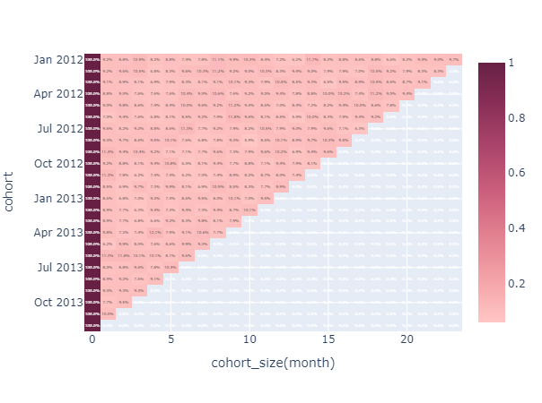
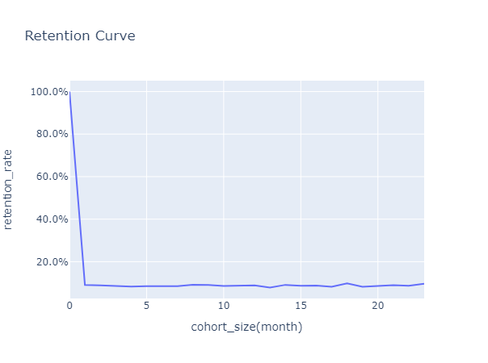

***

# ▶ 온라인 커머스 데이터 분석 

### - 목적

- 고객 관점에서 구매 활동성 증대 방안 도출
  -  코호트 및 RFM을 통한 고객 세그멘트 분류 후, 적합한 마케팅 실시

### - 기대효과

- 매출 성장 및 활동성 증대를 통한 이익 증가

### - 사용 툴

 

### - 데이터 설명

1. Customer : 5647 Row * 4 Col
    - DOB 컬럼 '%d-%m-%Y' 형식
    - Gender Null값 Unknown으로 대체
    - city_code Null값 11로 대체

|컬럼명|설명|
|---|---|
|customer_id |고객id|
|DOB|고객 생년월일 (날짜 형식 데이터)|
|Gender|고객 성별 (M : 남성 / F : 여성)|
|city_code|거주지 코드 (1부터 10까지 숫자로 구성)|

2. Transactions : 23053 Rows * 10 Columns
    - 2011-01-25 00:00:00 ~ 2014-02-28 00:00:00
    - tran_date 날짜 구분  통일 "-" 사용 양식으로 통일('%d-%m-%Y')
    - 중복값 제거
    - 음수 데이터는 취소(Cancel) 데이터로 확인되어 구분하는 컬럼 추가
    - 구매확정(confirmed_yn) 컬럼 추가

|컬럼명|설명|
|---|---|
|transaction_id |거래id|
|cust_id|고객id|
|tran_date|거래 일자 (날짜 형식 데이터)|
|prod_sub_cat_code|서브 카테고리 코드 (숫자 구성)|
|prod_cat_code|대 카테고리 코드 (숫자 구성)|
|Qty|주문 수량 (음수로 기록된 데이터도 존재)|
|Rate|판매 금액 (음수로 기록된 데이터도 존재)|
|Tax|세금 (음수로 기록된 데이터에도 양수로 기록됨)|
|total_amt|거래 금액 (판매 금액 x 주문 수량 + 세금)|
|Store_type|거래가 발생한 판매 채널 타입 (e-shop, TeleShop, Flagship store, MBR)|


3. prod_cat_info : 4 Rows * 23 Columns
   - 컬럼명 Transactions 테이블과 통일

|컬럼명|설명|
|---|---|
|prod_cat_code |대 카테고리 코드 |
|prod_cat|대 카테고리 명칭|
|prod_sub_cat_code|서브 카테고리 코드|
|prod_subcat|서브 카테고리 명칭|


- 세 데이터 Merge 후 결제 당시 나이(age) 컬럼 추가<br/>
    → 19세부터 44세까지 분포


### - EDA

#### - 2011년 기준

- 19세부터 41세까지 분포
- 나이 범위화 후 시각화  
- 성별 파이차트 

#### - 2013년 2월 28일 기준

- 첫 구매일자(first_purchase_date), 총 구매일수(count), 구매 경과 일수(days_elapsed), 구매주기(purchase_cycle) 컬럼 추가
  - 1376명이 한번만 방문하여 구매주기가 계산되지않음
- 2011년 대비 전체 고객 수가 증가한 모습
- 39-43의 비율이 높아짐 
- 남성의 비율 소폭 상승 
- 구매 경과 일수, 구매 주기는 큰 차이 없음(2회 이상 방문자만) 
- 34-38 연령대의 1회 결제 후 미방문 고객이 많아 경과일수가 상대적으로 높음 [alt text](image-7.png)
- 구매한지 30일 이상 회원 대상 프로모션(2013-03-01~2013-12-31) 4675명 중 2800명 참여 

#### - 요일 확인
- 환불 건 제외된 구매확정 건들의 요일 분포
  
|요일|주문건수|기간 내 요일 등장 빈도|평균 주문건수|
|---|---|---|---|
|Friday|2750|162|16.975309|
|Monday|2637|161|16.378882|
|Saturday|2687|161|16.689441|
|Sunday|2729|160|17.056250|
|Thursday|2701|	162|16.672840|
|Tuesday|2611|161|16.217391|
|Wednesday|2704|161|16.795031|

#### - 카테고리 확인
- 3년간 카테고리별 월평균매출
  - 변동계수(cv) 기준 Clothing 1위, Bags 2위로 가장 큼 → 시즌마다 매출변동성 큼
  - 평균으로는 Books가 1위 → 꾸준하게 매출이 높음


|상품명|평균|분산|표준편차|변동계수|
|---|---|---|---|---|
|Clothing|166,016|1.63e+09|40,381|0.243|
|Bags|109,989|6.26e+08|25,027|0.228|
|Footwear|166,962|1.35e+09|36,705|0.220|
|Home and kitchen|224,517|1.80e+09|42,372|0.189|
|Electronics|285,979|2.75e+09|52,472|0.183|
|Books|341,675|2.98e+09|54,624|0.160|

### 분석
- 구매화정건만 추출
- 모든 기간을 포함하고 있는 2012,2013만 사용
- 리텐션율 계산
```
# 리텐션율 계산 
retention = pd.DataFrame()
for s in tqdm(ord_ym_list):
    for t in ord_ym_list:
        period_start = s
        period_target = t

        if period_start <= period_target:
            period_start_users = set(retention_data.query('ord_ym == @period_start')['customer_Id'])
            period_target_users = set(retention_data.query('ord_ym == @period_target')['customer_Id'])

            retained_users = period_start_users.intersection(period_target_users)

            retention_rate = len(retained_users)/len(period_start_users)

            temp = pd.DataFrame({'cohort':[period_start], 'ord_ym':[period_target], 'retention_rate':[retention_rate]})

            retention = pd.concat([retention, temp])
```


- RFM
  - 2013년 6월, 12월 
  - recency_score(3: 가장 최근에 구매한 고객2: 중간, 1: 오래된 고객).
monetary_score(1: 낮은 구매액, 2: 중간, 3: 높은 구매액).
frequency_score(1: 낮은 빈도, 2: 중간, 3: 높은 빈도).
-    '1_최우수''2_우수''3_윈백대상''4_최신성존재_구매필요''5_휴면'
- rfm_user_now['overall_score'] = rfm_user_now['recency_score'].astype(int)*0.4 + rfm_user_now['monetary_score'].astype(int)*0.4 + rfm_user_now['frequency_score'].astype(int)*0.2
- 상승 동일 하락 


### - 결과 및 결론

- 동일 + 하락의 고객이 더 만음 (50퍼 초과)
해당 고객에게 추가적인 마케팅
상승 고객 대상에게는 별도 마케팅, 추가 분석을 통해 상승 이유 도출


### - Lesson & Learned
- 코호트 분석 , 리텐션, RFM
- 데이터 결합 시 양식 통일 주의
- 현업에서 연간 트렌드 분석을 통해 서비스 개선점 발견 가능
- query,intersection,