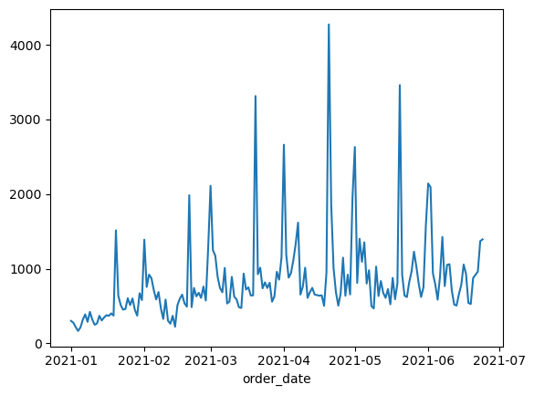
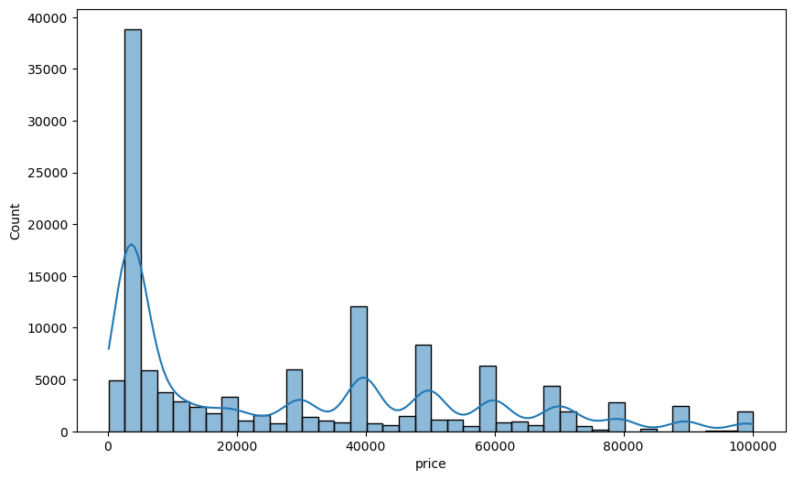
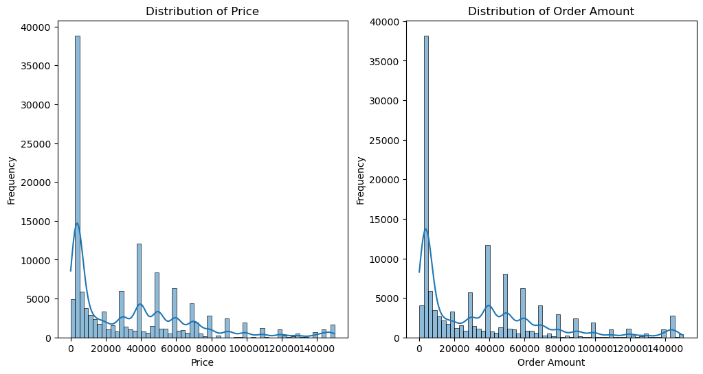
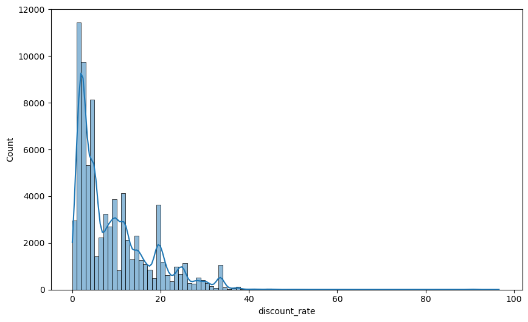
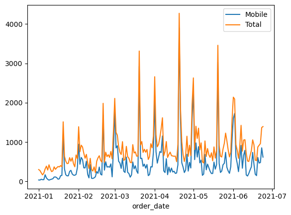

***

# ▶ 고객 추가 구매 유도 방안 수립 

### - 목적

-  가상 이커머스 ‘다잇다'의 고객 구매 이력 데이터를 기반으로 고객의 추가 구매 유도를 하기 위한 방안을 수립

### - 기대효과

- 고객의 추가 구매 유도를 통한 매출 및 이익 증가

### - 사용 툴

 

### - 데이터 설명

- online_commerce_data 
  - 147,311 Rows * 14 Columns
  -  2021-01-01 00:00:00 ~ 2021-06-24 00:00:00
  -  고유 회원 72,060명
  

      |컬럼|설명|
      |---|---|
      |customer_no|고객번호 (eg. 2019073300103 고객의 가입연월 2019-07)|
      |age|고객 연령|
      |gender|고객 성별 (1 : 남성, 2 : 여성, 9 : 성별 알 수 없음)|
      |order_no|주문 번호|
      |order_date|주문 일자|
      |channel|주문 채널 (TV, Mobile)|
      |item_category|아이템 카테고리|
      |item_code|아이템 코드|
      |item_name|아이템명|
      |price|판매가|
      |qty|주문 수량|
      |order_amount|주문 금액|
      |discount_amount|할인 금액|
      |paid_amount|고객 결제 금액|

### - 가설

- 주기적으로 구입하는 옷과 음식이 재구매 및 추가 구매율이 높을 것으로 예상 
→ 옷과 음식 할인을 통해 '다잇다'에 방문률을 높일 수 있을 것

### - EDA

- order_date
  - 날짜에 따른 주문 건수 Line plot
  - 월 말마다 주문량이 증가하는 경향 
   

- day
  - 요일별 비교를 위해 새로운 컬럼 day 생성
  - 수 > 목 > 화 > 월 > 토 > 금 > 일

    |요일|주문건수|
    |---|---|
    |Sunday|15,824|
    |Friday|17,394|
    |Saturday|20,540|
    |Monday|22,668|
    |Tuesday|22,716|
    |Thursday|22,909|
    |Wednesday|25,260|

- channel
  - Mobile 의 비율이 더 크다

    |채널|주문건수|비율|
    |---|---|---|
    |Mobile|84,407|57.3%|
    |TV|62,904|42.7%|

- item
  - 생수의 높은 판매량으로 일반 식품이 46.84% 차지
  - 카테고리 Top 5
    |카테고리명|주문건수|비율|		
    |---|---|---|
    |일반식품|69,002|46.84%|
    |레포츠패션|11,523|7.82%|
    |생활용품|9,289|6.31%|
    |언더웨어|8,946|6.07%|
    |건강식품|8,889|6.03%|

  - 상품코드 Top 10 

    |상품코드|주문건수|비율|상품명|
    |---|---|---|---|
    |320105539|18,336|12.45%|생수|
    |321981732|8,411|5.71%|생수|
    |320077263|4,873|3.31%|생수|
    |321935656|3,199|2.17%|드로즈|
    |320105541|2,185|1.48%|생수|
    |323393459|1,858|1.26%|기초세트|
    |322614618|1,593|1.08%|생수|
    |322634110|1,119|0.76%|티셔츠|
    |321993603|958|0.655%|생수|
    |320036696|938|0.64%|핸디형청소기|

  - 상품명 Top 10

    |상품명|주문건수|비율|
    |---|---|---|
    |생수|39,696|26.95%|
    |드로즈|3,956|2.69%|
    |티셔츠|3,917|2.66%|
    |캐주얼화|3,811|2.59%|
    |트랙수트|3,435|2.33%|
    |오메가3|2,919|1.98%|
    |기타 간편/즉석식품|2,419|1.64%|
    |황사마스크|2,409|1.64%|
    |기초세트|2,220|1.51%|
    |화장지|1,707|1.16%|

- price
  - 2500~5000원 금액대가 가장 많은 모습
  - 단수 가격 전략으로 만원 주기로 주문량이 늘어남  
  

- qty & order_amount
  - 88.6%가 1개씩만 구입
  → 주문 금액과 상품 금액이 유사한 모습 
  

- discount
  - discount_amount 컬럼으로부터 할인율 컬럼 생성
  - 주문건수 전체의 47.6%가 할인 없음
  - 대부분 10% 이내의 할인율과 최대값 96.6% 
    

### 분석
- 모바일 고객 인원 이 더 적지만 금액과 주문건수가 많음 
  → 모바일 고객 위주로 전략 수립

      |체널|고객수|주문건수|금액|구입 개수|
      |---|---|---|---|---|
      |Mobile|27,364|84,407|8,643,217,197|135,868|
      |TV|46,355|62,904|7,673,884,623|86,589|
      |전체|72,060|147,311|16,317,101,820|222,457|

- 요일별 주문 건수
  - 전체와 유사한 양상 
  -  전체 대비 월요일과 목요일의 순서가 바뀐 것 말고는 동일 
  모바일 주문건수 순위 : 수 > 목 > 화 > 월 > 토 > 금 > 일
  

- 카테고리
  - 일반식품의 비율이 전체에서는 46.84%이었으나, 모바일에서는 68%로 매우 더 높아짐
  - 상품명 Top10 
    - 전쳬에서는 옷의 비중이 높았으나, 모바일에서는 음식의 비중이 높아진 모습
      - 전체

        |상품명|주문건수|비율|
        |---|---|---|
        |생수|39,696|26.95%|
        |드로즈|3,956|2.69%|
        |티셔츠|3,917|2.66%|
        |캐주얼화|3,811|2.59%|
        |트랙수트|3,435|2.33%|
        |오메가3|2,919|1.98%|
        |기타 간편/즉석식품|2,419|1.64%|
        |황사마스크|2,409|1.64%|
        |기초세트|2,220|1.51%|
        |화장지|1,707|1.16%|

      - 모바일

        |상품명|주문건수|비율|
        |---|---|---|
        |생수|39,510|46.81%|
        |드로즈|3,293|3.90%|
        |기타 간편/즉석식품|2,419|2.87%|
        |드럼세탁기|1,370|1.62%|
        |건강음료|1,182|1.40%|
        |탄산수|1,159|1.37%|
        |일반세탁기|1,145|1.36%|
        |골드바/코인|1,098|1.30%|
        |냉장고/냉동고|1,032|1.22%|
        |핸디형청소기|940|1.11%|

- 할인
  - 전체 47.6% 대비 할인 없이 구입하는 비율 68.99%로 증가
  - 생수 및 일반식품은 할인 없이도 구매율이 높음
  - 가전처럼 높은 가격대의 제품의 할인율이 적음
    - 할인율 10%이내 상품명 Top10

      |상품명|주문건수|
      |---|---|
      |드럼세탁기|1370|
      |일반세탁기|1145|
      |생수|1126|
      |냉장고/냉동고|1032|
      |핸디형청소기|934|
      |LED TV|867|
      |골드바/코인|652|
      |모바일 상품권|539|
      |기타 간편/즉석식품|461|
      |일반압력밥솥|443|

  - 일반식품의 경우 할인율에 상관없이 상위권 유지
  - 할인율 10% ~ 30% 적용된 건 확인 시, 탄산수/이유식/분유/김치 같이 주기적 구입이 필요한 상품들이 랭크인
    -  할인율 10%~30% 상품명 Top10

        |상품명|주문건수|
        |---|---|
        |탄산수|931|
        |기타 간편/즉석식품|588|
        |IH압력밥솥|557|
        |골드바/코인|446|
        |이유식|352|
        |일반압력밥솥|327|
        |분유|325|
        |기타 반찬류|241|
        |주방세제/베이킹소다|240|
        |포기김치|205|

### - 결과 및 결론

- 모바일의 회원들의 구입률이 높음
- 일반식품은 할인율 상관없이 잘 팔림(특히 생수)
- 대형제품의 경우 약간의 할인으로도 큰 금액이 할인 되게에 높지 않은 할인율에도 높은 판매량을 기록
- 탄산수,이유식 같은 소비품은 할인율이 크면 미리 구입해두는 것으로 판단 
  → 소비품을 주기적으로 할인하여 '다잇다'의 방문율을 높이고, 단수 가격을 통해 추가 구매를 높일 수 있다고 판단됨.

### - Lesson & Learned
- 현업에서 구매 주기 도래 시 해당 아이템에 대한 마케팅 메시지, 캠페인 / 가격 탄력성이 있는 품목의 경우 약간의 할인 전략 등 진행함
- 표 깔끔하게 정리했만 시각화가 부족, 시각화를 더 사용하자 (추후 추가 예정)