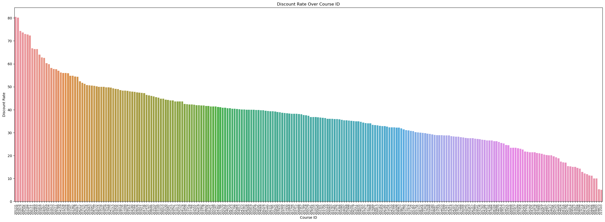

***

# ▶ 실제 패스트캠퍼스 데이터 분석 

### - 목적
- 고객의 시간대별 특징 추출

### - 기대효과
- 고객 특징 도출을 통해 추가적인 마케팅 방안 마련으로 매출증대

### - 사용 툴

    

### - 데이터 설명


1. order
  - 27894 Rows * 11 Columns
  - 2022-01-01 ~ 2023-08-28

2. course
  - 27894 Rows * 9 Columns
  - 2022-01-01 ~ 2023-08-28

3. customer
 - 27894 Rows * 5 Columns
 - 2022-01-01 ~ 2023-08-28
 - 
4. refund
 - 27894 Rows * 8 Columns
 - 2022-01-01 ~ 2023-08-28


### - 문제

- SQL
  1. 4개의 테이블을 하나의 테이블로 조인하는 쿼리 작성

      ```
      -- 동일한 컬럼명들 수정
      ALTER TABLE customer
      RENAME COLUMN id TO customer_customer_id,
      RENAME COLUMN state TO customer_state,
      RENAME COLUMN created_at TO customer_created_at,
      RENAME COLUMN updated_at TO customer_updated_at;

      ALTER TABLE course
      RENAME COLUMN id TO course_course_id,
      RENAME COLUMN state TO course_state,
      RENAME COLUMN created_at TO course_created_at,
      RENAME COLUMN updated_at TO course_updated_at;

      ALTER TABLE refund 
      RENAME COLUMN order_id TO refund_order_id,
      RENAME COLUMN created_at TO refund_created_at,
      RENAME COLUMN updated_at TO refund_updated_at;


      -- Merge
      CREATE TABLE merged AS
      SELECT
        order_.*,
        customer.*,
        course.*,
          refund.*
      FROM
          order_
      LEFT JOIN customer ON order_.customer_id = customer.customer_customer_id
      LEFT JOIN course ON order_.course_id = course.course_course_id
      LEFT JOIN refund ON order_.order_id = refund.refund_order_id;

      -- 확인
      SELECT  *
      FROM  merged
      ```

  2. 2022년 1월 일자별 가장 빠르게 신청된 강의와 가장 나중에 신청된 강의

      ```
      SELECT DISTINCT 
        LAST_VALUE(name) OVER (PARTITION BY DATE(created_at)) AS earliest_course_name,
        LAST_VALUE(course_id) OVER (PARTITION BY DATE(created_at)) AS earliest_course,
        LAST_VALUE(created_at) OVER (PARTITION BY DATE(created_at)) AS earliest_course_created_at,
        FIRST_VALUE(name) OVER (PARTITION BY DATE(created_at)) AS latest_course_name,
        FIRST_VALUE(course_id) OVER (PARTITION BY DATE(created_at)) AS latest_course,
        FIRST_VALUE(created_at) OVER (PARTITION BY DATE(created_at)) AS latest_course_created_at
      FROM order_
      WHERE DATE(created_at) BETWEEN '2022-01-01' AND '2022-01-31';
      ```

  3. Order 테이블의 list_price를 일자별로 합계한 후 , 1일 전과 1일 후의 매출

      ```
      CREATE TABLE total_sales AS
      SELECT
        sale_date,
        total_sales,
        LAG(total_sales, 1) OVER (ORDER BY sale_date) AS sales_1_day_before,
        LEAD(total_sales, 1) OVER (ORDER BY sale_date) AS sales_1_day_after
      FROM (
        SELECT
          DATE(created_at) AS sale_date,
          SUM(list_price) AS total_sales
        FROM
          order_
        GROUP BY
          DATE(created_at)
      ) AS DailyTotalSales
      ORDER BY
        sale_date;

      SELECT *
      FROM total_sales;
      ```


- 문제

  1. 2022년 1월 중 가장 매출이 높았던 3일과 낮았던 3일은 언제인가요?
  - Top 3 : 3일, 9일, 5일
  - Worst 3 : 22일, 1일, 23일 <br/>
    

  2. 그리고 그 떄의 매출액, 주문 수, 신청자 수 , 강의 수는 각각 얼마인가요?
  - 빨강 = 일 매출액 , 파랑 = 주문 수, 신청자 수 , 강의 수
  - 매출액, 주문 수, 신청자 수, 강의 수 전체적으로 비례하는 모습<br/>
  
  
  3. 각 강의 별 할인율은 어떻게 될까요?
  - 구매 시기와 고객에 따라 같은 강의도 다른 할인율이 적용됨
  - 강의별 평균 할인율 시각화<br/>
  
  - 평균 할인율이 높은 강의 순으로 정렬(최고 할인율 80%)<br/>
  

  4. 회원들은 주로 몇 시에 회원 가입을 했나요?
  - 오후 15시부터 급격하게 감소하는 모습<br/>
  

  5. 환불이 가장 많은 강의는 어떤 강의였나요?
  - 강의번호 203720가 31회로 가장 환불이 많음<br/>
  

  6. 강의를 가장 많이 신청한 고객과 그 금액은 얼마인가요?
  - 고객번호 116416 구매 강의 수가 2개이나 결제 금액이 큼 (B2B강의)
  - 이외에는 전체적으로 신청한 강의 수와 금액이 비슷함<br/>
   

  7. 주말과 주중의 평균 강의 신청율은 어떻게 다를까요?
  - 평일 : 주말 = 11455 : 4706 = 70.9% :29.1%
  - 하루 평균 주문을 계산하면 70.9/5 = 14.2 , 29.1/2 = 14.6 주말이 더 높음<br/>
  

  8. Keyword 열에서 가장 많이 반복되는 단어는 어떤 단어인가요?
  - '평생소장' 64회로 최다
  - 트리맵으로 시각화<br/>
  


  9. 강의 가격을 5만원 단위의 도수분포표로 나타내주세요
  - 이상치 제외 금액 150만원 이하 시각화<br/>
  

  10.  신청이 완료된 강의와 진행중인 강의, 그리고 취소된 강의 간의 금액과 유저의 비중은 각각 어떻게 될까요?
  - 전체 데이터의 상태 분포<br/>
  
  - 상태에 따른 금액 분포
    - 취소 상태의 전체 금액이 가장 크다 → 구입 후 단기간 내에 할인 시 환불 후 재구매가 많다.<br/>
  
  
  |주문 상태|주문 당 가격|
  |---|---|
  |CANCELLED|250,282|
  |COMPLETED|225,478|
  |PENDING|235,483|

### - 가설

1. 요일에 따른 주기성이 있을 것이다.
2. 주문량이 높은 시간대가 있을 것이다.
3. 시간대에 따른 특성이 존재할 것이다.

### - 분석
- 요일 별 주문수 (월 > 일 > 금 > 수 > 화 > 목 > 토)

    |요일|주문수|
    |---|---|
    |월|3,090|
    |화|1,889|
    |수|2,144|
    |목|1,879|
    |금|2,453|
    |토|1,634|
    |일|3,072|

  - COMPLETED 시간별 분포 / PENDING&CANCELLED 시간별 분포 / 할인 적용된 주문 분포
    - 모두 동일하게 15시 ~ 23시의 주문 건수가 적음
    - 월/수/금/일 이 화/목/토에 비해 상대적으로 높은 모습<br/>
    

- 주기성 확인
  - 구매율이 높은 요일이 있을 것이라 예상했으나, 불규칙적인 모습
  - 이벤트 마감일자에 맞춰 주문이 증가
  - 주기성 확인을 위해 이벤트 진행내역과 넓은 기간의 데이터 필요
  
    |프로모션|마감일자|
    |---|---|
    |1+1 이벤트|1/9|
    |페이백 이벤트|1/16|
    |2+2 이벤트|1/21|
    |가격 인상 전 마지막 가격|1/31|

  

- 할인율 확인
  - 주문 대비 할인 받은 비율(%)
  - 주문량이 적었던 오후시간에, 할인 받는 비율이 낮음
  

### - 결과 및 결론

1. 이벤트 마감이 많은 월/수/금/일이 주문 건수 많음<br/>
  → 이벤트 및 다양한 일정 고려하여 패턴 추가 파악 필요

2. 새벽시간부터 14시까지 주문이 많으며, 일요일 점심시간의 주문이 가장 많음<br/>
  → 요일 상관 없이 오후에 주문 건수가 줄어듬<br/>
  → 오후 깜짝 쿠폰 제공을 통해 사이트 접속률 상승 및 구매율 상승시키기

3. 오후 시간에 구입 시 할인 적용 받는 비율이 낮음<br/>

### - Lesson & Learned

- 쿼리에 '*' 지양할 것
  1. 테이블에 새 컬럼 추가시 영향 받음
  2. 조인 시 컬럼명 중복 가능성 존재
  3. 협업시 커뮤니케이션 문제 야기 가능
- 최저 매출 3일에서 ascending보다는 tail 추천
- agg 응용 연습하기
- reset_index() 익숙해지기
- 요청에만 답을 하기 보다는 데이터를 계속 보면서 스스로 질문을 하고 답을 찾는 과정이 중요!
- 결과 출력시, 숫자에 천단위 쉼표 추가 추천
- 더 다양한 시각화 추천