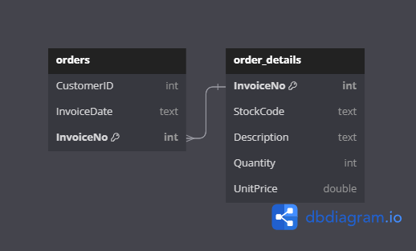
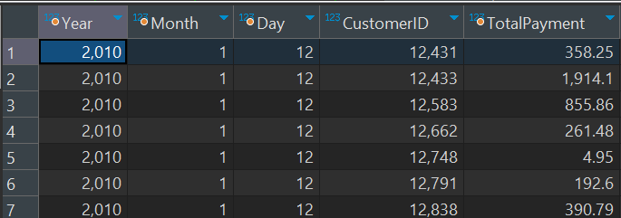

***
# ▶ 퇴직을 촉발하는 주요 요인 발굴 

### - 문제
- Q. 일자별로 가장 많은 금액을 구매한 사람을 추출하고, 아래 형식과 같이 결과를 표시해주세요.
만약 구매 금액이 동일할 경우 고객번호가 빠른 한 사람만 추출해주세요. 결과를 연-월-일-고객번호 오름차순으로 정렬해주세요.

- 결과 예시 
 Year | Month | Day | CustomerID | Total Payment |

### - 사용 툴

 

### - ERD 


### - 쿼리
```
SELECT 
    YEAR(o.invoicedate) AS Year,
    MONTH(o.invoicedate) AS Month,
    DAY(o.invoicedate) AS Day,
    o.customerid AS CustomerID,
    SUM(od.quantity * od.unitprice) AS TotalPayment
FROM 
    orders o
JOIN 
    order_details od ON o.invoiceno = od.invoiceno
GROUP BY 
    YEAR(o.invoicedate),
    MONTH(o.invoicedate),
    DAY(o.invoicedate),
    o.customerid
ORDER BY 
    YEAR(o.invoicedate) ASC,
    MONTH(o.invoicedate) ASC,
    DAY(o.invoicedate) ASC,
    o.customerid ASC;
```

### - 결과


<!--Lesson&Learned-->
### - Lesson & Learned
-  쿼리 연습을 통해 쿼리문 짜는 시간 단축 필요
- 시간내로 금액이 동일한 경우를 처리 하지 못했음
```
SELECT 
    YEAR(o.invoicedate) AS Year,
    MONTH(o.invoicedate) AS Month,
    DAY(o.invoicedate) AS Day,
    o.customerid AS CustomerID,
    MIN(od.total_payment) AS TotalPayment
FROM 
    orders o
JOIN 
    (SELECT 
         invoiceno,
         SUM(quantity * unitprice) AS total_payment
     FROM 
         order_details
     GROUP BY 
         invoiceno) od ON o.invoiceno = od.invoiceno
GROUP BY 
    YEAR(o.invoicedate),
    MONTH(o.invoicedate),
    DAY(o.invoicedate),
    o.customerid
ORDER BY 
    Year ASC,
    Month ASC,
    Day ASC,
    CustomerID ASC;
```
***