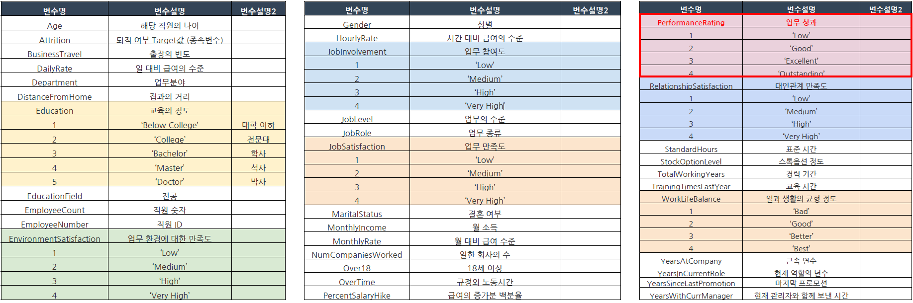
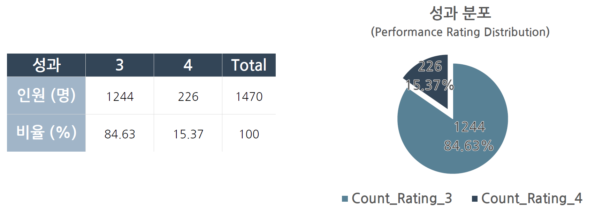
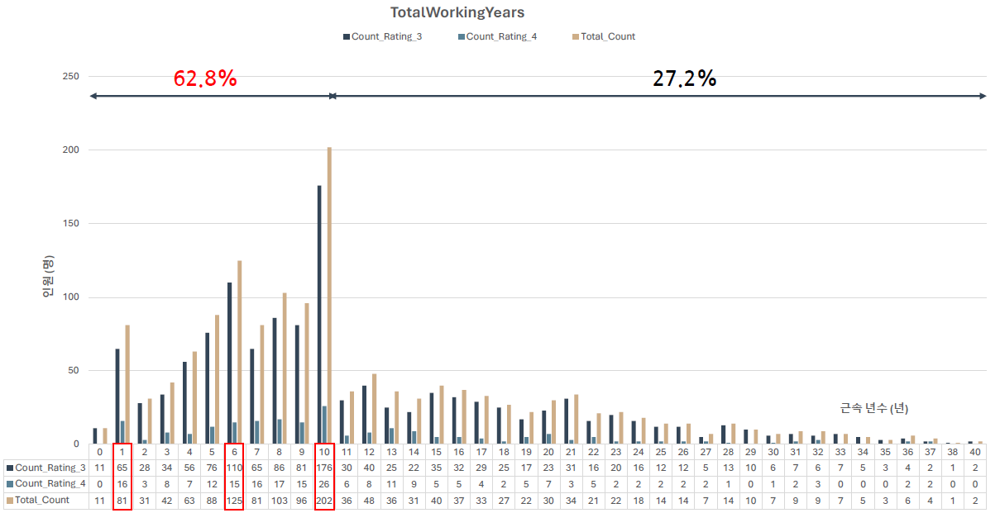
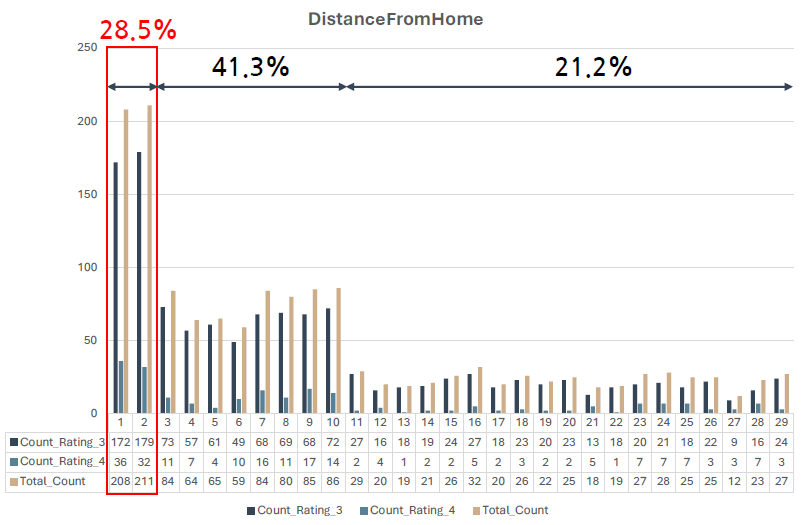
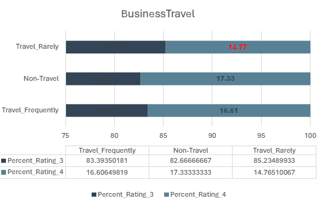

***

<!--제목-->
# ▶ 우수 성과자들의 특성 확인 

<!--목적-->
### - 목적

- 직장 내 우수 성과자들의 특성을 확인하여, 임직원의 업무 성과 향상 방안을 도출

<!--기대효과Expected Impact-->
### - 기대효과

- 적절한 개발 프로그램을 설계 → 임직원의 역량 향상을 통한 회사의 생산성 증대

<!--기간Project Duration-->
<!--역할Role-->
<!--사용 툴Tools Used-->
### - 사용 툴

     

<!--데이터 설명Data Description-->
### - 데이터 설명
- 임직원 데이터 : 1470 Row * 35 Col

- 성과 분포
  - 성과 1과 2는 제외되고 **3과 4**만으로 구성
  - 성과 3 : **성과 4** = 84.6% : **15.4%** 로 불균형 데이터

<!--분석 프로세스Analysis Process(전처리,피쳐셀렉션,표준화/정규화,모델셀렉션,성능평가/Threshold,...)-->
<!--결과Results-->
### - 결과 및 결론
- 승진 시기인 6, 10년에 진급하기 위해 높은 성과를 받는 것으로 판단됨
**승진 주기를 짧게, 계급을 다양화** 하면 지속적인 높은 성과를 위한 동기부여가 될 것으로 예상됨.

 

- 집과의 가까우면, 거리가 있는 경우 보다 높은 성과(4) 비율이 높음.
  - **기숙사 및 회사 인근 주택 대출 제도** 를 통해 임직원의 사기를 증진 시킬 수 있을 것으로 예상됨

    |집과의 거리|성과 4의 비율|
    |------|---|
    |1 & 2|**16.2%**|
    |3 ~ 10|14.8%|
    |11 ~|15.3%|

 

- 가끔 출장가는 경우, 업무의 흐름을 놓쳐 업무의 깊이가 달라져 상대적으로 높은 성과를 받기 어려움.
    - 긴급한 경우가 아닌 경우, 해당 업무의 마무리 또는 시작에 맞춰 출장이 필요함.

 

<!--Lesson&Learned-->
### - Lesson & Learned
-  문제정의 → **가설** → 분석 → 결과 → 결론 순으로 보고서 작성 추천!
    데이터를 보고 가설 설정하고 이를 증명하는 방향으로 잡기
- 결론 도달 시 **비약 조심**!!!
-  해당 차트 다음과 같은 상황에 추천!
   - 점유율 강조해서 표현 시 **파이 차트**
   - 다양한 변수 비교 시 **레이더 차트**
   - 시계열 표현시 **라인 플롯**
   - 양적으로 비교 시 **바 플롯**
- 그래프마다 강조하고 싶은 내용을 **글**로 적어줄 것
- 그룹화 진행으로 새로운 **인사이트** 발견 가능
- SQL 및 데이터베이스 실제 적용은 처음이라 미숙함
  -  **양식 통일** 필요

** 자세한 내용은 PDF 확인해주세요!**
***