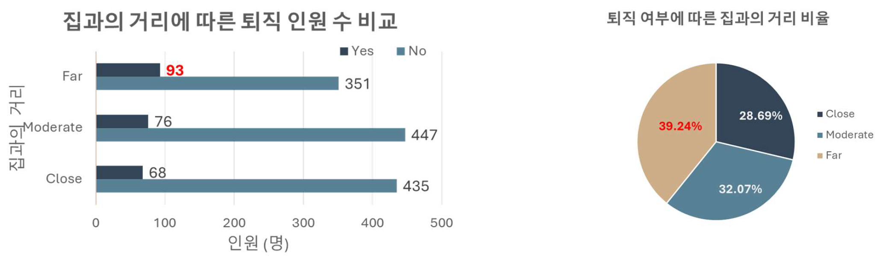

***

<!--제목-->
# ▶ 퇴직을 촉발하는 주요 요인 발굴 

<!--목적-->
### - 목적

- 퇴직을 촉발하는 주요 요인을 발굴하고 이를 대비하고자함

<!--기대효과Expected Impact-->
### - 기대효과

- 퇴직 주요 요인 발굴 → 잦은 퇴직을 방지하여 회사의 생산성 향상
<!--기간Project Duration-->
<!--역할Role-->
<!--사용 툴Tools Used-->
### - 사용 툴

     

<!--데이터 설명Data Description-->
### - 데이터 설명
- 임직원 데이터 : 1470 Row * 35 Col (Task1과 동일한 데이터)

- 퇴직 여부(Attrition)
  - 재직 : **퇴직** = 83.9% : **16.1%** 로 불균형 데이터
  

<!-- 가정 및 가설 -->
### - 가정
1. 모두 계약직이 아닌 **정규직 데이터**로, **자발적 퇴사**라 가정ㄴㄴ
2. 올해 1년간 하루라도 일한 임직원의 데이터라 가정함
3. 퇴직한 인원의 측정 데이터는 올해 존재할 수 없으므로, 측정 데이터 중 최근 데이터라 가정

### - 가설
1. **집과의 거리**가 멀수록 퇴사율이 높아질 것이다.
2. **소득**이 낮을수록 퇴사율이 높아질 것이다.
3. **업무**가 맞지 않으면 퇴사율이 높아질 것이다.
4. **만족도**가 낮으면 퇴사율이 높아질 것이다.
5. **미혼**이면 퇴사율이 높아질 것이다.

<!--분석 프로세스Analysis Process(전처리,피쳐셀렉션,표준화/정규화,모델셀렉션,성능평가/Threshold,...)-->
### - 변수 확인

  
변수 확인 (Folded)

1. 집과의거리
   - 재직자 중 집과의 거리가 11 이상인 인원은 큰 폭으로 줄어드나, 퇴직자 인원은 변화량이 크지 않음
     - 집과의 거리가 가깝거나 보통일 때 퇴사율이 각각 13.5% / 14.5%이나, **멀어질 경우 무려 20.9%(93/444)** 퇴사
     → **기숙사, 대출 지원** 같은 지원을 통해 퇴직율을 감소시킬 수 있다 판단됨.
   

2. 월소득 & 경력기간 & 업무 수준
    - 퇴직자의 **46%(108명)가 하위 25%의 월 소득**을 수령
      - **108명 중 107명**의 업무 수준이 1, **86명**이 경력기간 7년차 이하 
      → **업무 수준이 낮은 저년차 임직원의 관리**가 필요.
    

3. 업무환경 만족도 & 직업 만족도 & 관계 만족도
    - 세가지 만족도 모두 낮을수록 퇴직 비율이 높음
    → 만족도 조사 이후, 만족도가 낮을 경우 **별도의 관리 프로그램** 및 지속적인 모니터링 필요.
    

4. 업무 성과
    - 높은 업무 성과(3,4)만이 데이터로 있고 낮은 업무 성과(1,2)는 데이터가 없음
      - 해당 데이터만으로는 관계성이 크게 없다고 판단되나 4의 경우 0.29%P 높음
      → 타 기업으로부터의 스카우트 제의 및 이직 가능성
    

5. 결혼 여부
    - **미혼인 경우 퇴직률이 25.5%(120/470)**으로 높으며, **퇴직 인원의 50.6%(120.237)**를 차지함
    → **사내 소개팅, 동아리** 등 이성 교류 기회를 확보하여 퇴직율을 감소시킬 수 있다 판단됨.
    

6. 워라밸 & 야근여부
    - **워라밸이 1의 31.25%(25/80)**이 퇴직
    → 야근 여부와 집과의 거리가 워라밸에 영향을 준다 생각하고 워라밸 1인 80명 확인하였으며, 야근시, 집과의 거리가 멀면 퇴직자의 비율이 높음을 확인함
    → 워라밸을 위한 유연 근무제, 재택 근무제 활성화가 필요.
    

<!--결과Results-->
### - 결과 및 결론

- 집과의 거리가 먼 444명 중 93 명이 퇴사하였으며 **20.9%**에 해당됨
  퇴직자 **39.24%**(93/237)가 집과의 거리가 멂
  → 집과의 거리가 멀면 퇴직 가능성이 높아진다
  → 거리를 감소시키기 위해 **기숙사, 회사 인근 주택 대출 지원** 같은 복지 프로그램을 통해 주요 인재 이탈 방지

 

- 업무 수준이 낮으면(1), 퇴직률이 **26.34%**(143/543)로 매우 높음
  해당 업무 수준의 **65%가 월 소득 하위 25%**로 소득이 적음
  → 낮은 난이도와 임금으로 인해 퇴사한다고 판단됨
  → 퇴사를 방지하고자 낮은 난이도 업무의 임금을 올리는 것은 맞지 않음
  → **업무 수준이 낮아도 오래 다니는 직원의 특성을 도출하여, 채용 시 해당 사항을 평가에 적용 **

<!--Lesson&Learned-->
### - Lesson & Learned
-  복잡한 시각화는 **참고 장표**로 맨 뒤로 보내기
  → 강조하고 싶은 부분만 핵심적으로 그리기
-  **논리적 비약 조심**!
→ 추가적인 인터뷰, 타사 사례나 논문 등에서 결과가 있으니 데이터를 다시 모아서 분석해보자는 식으로도 가능
-  '분석 결과를 **명확하게 전달**' + '**분석의 목**적이 잊지 말기'
-  그룹화, 세분화 **심슨의 역설** 조심!

** 자세한 내용은 PDF 확인해주세요!**
***