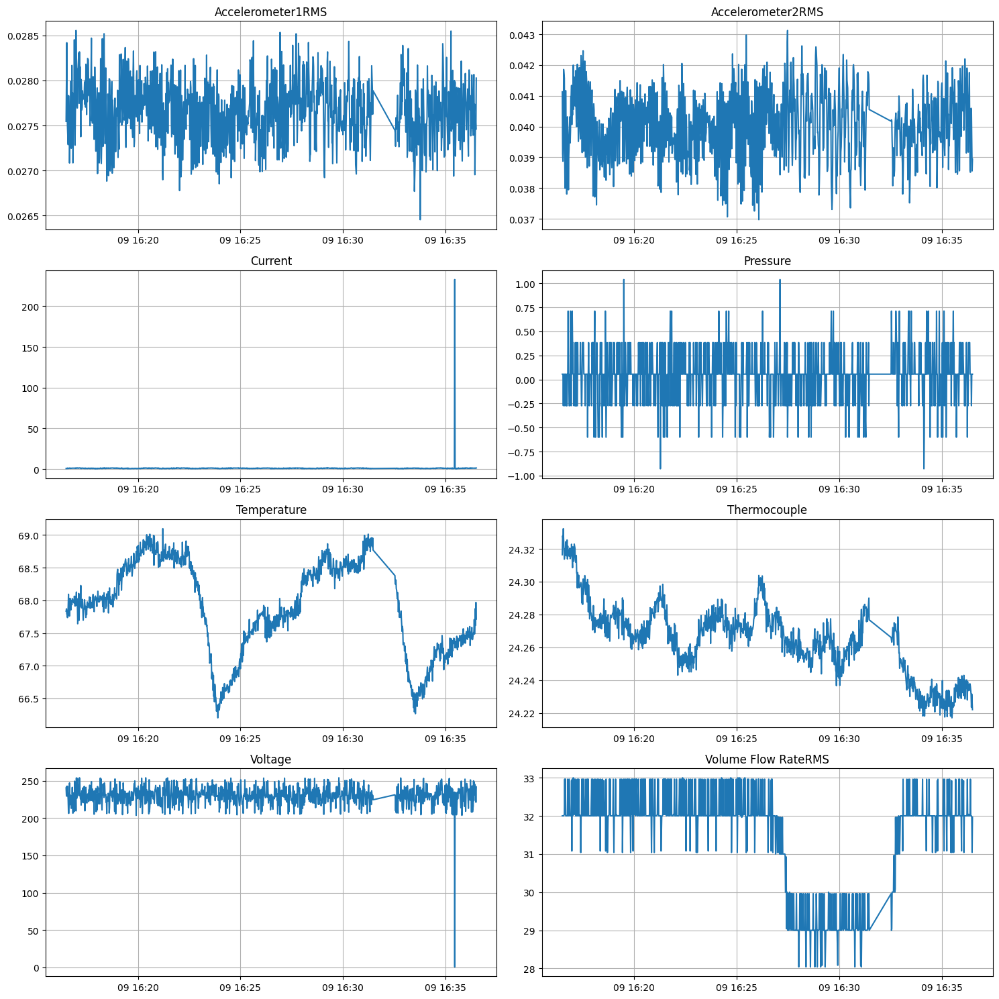
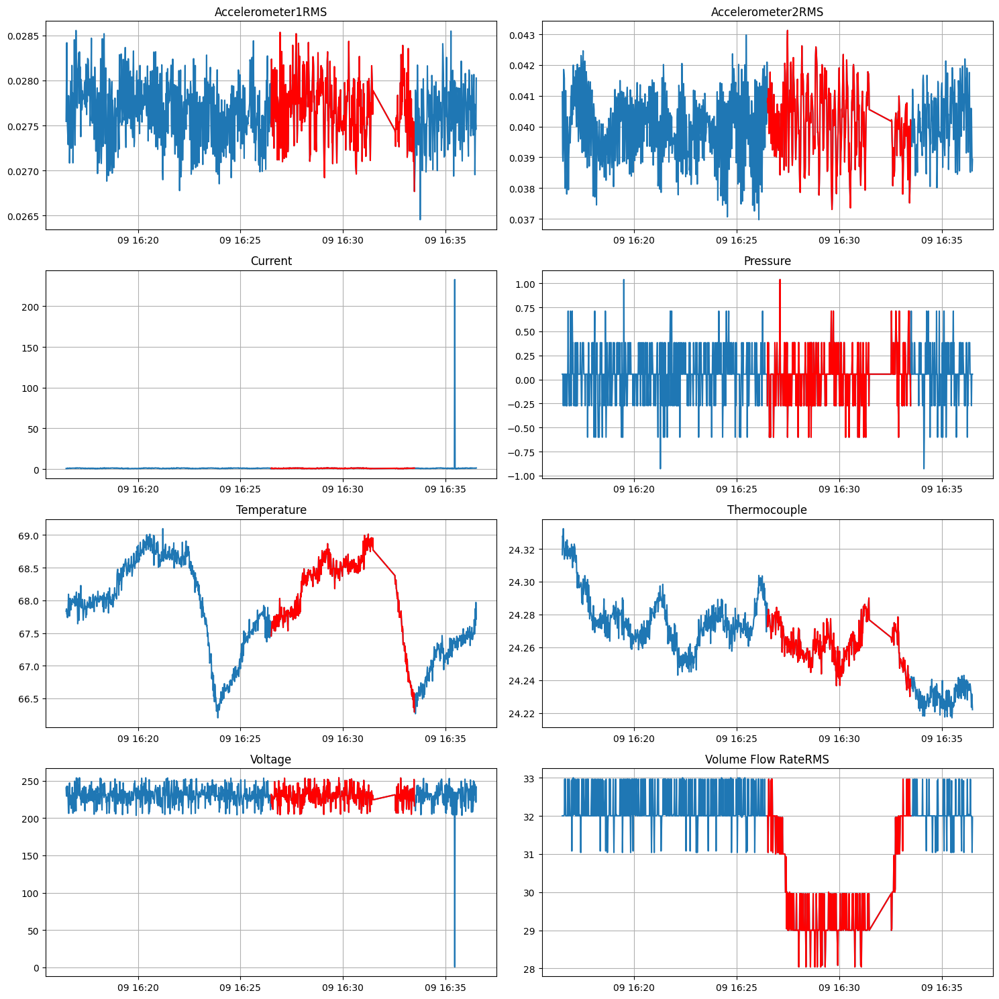
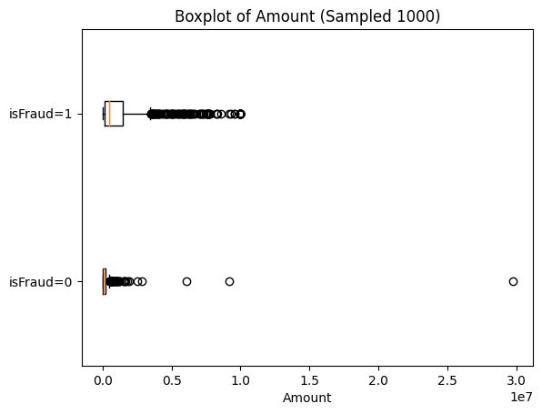
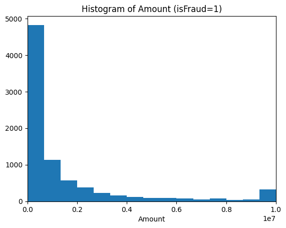
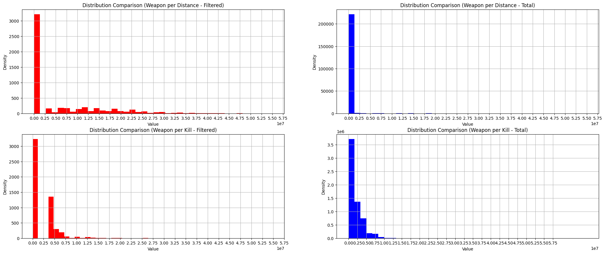
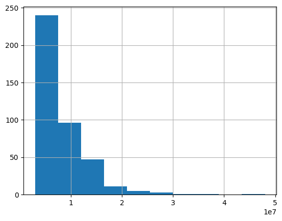

***

# ▶ 제조, 금융, 게임 데이터 기본 

### - 목적

- 세 분야 별로 주어진 문제 풀이 및 시각화

### - 사용 툴

 


## - 분야별 문제 풀이
<details>
<summary>1. 제조(Folded)</summary>

### - 데이터 설명
- 제조 데이터 : 1063 Rows * 11 Columns
  - 2020-03-09 16:31:29 ~ 16:32:31 1분간 없으며, 중간 데이터 누락(75개) 존재.

      |Column|Description|
      |------|------|
      |datetime|시간|
      |Accelerometer1RMS|진동 가속도1|
      |Accelerometer2RMS|진동 가속도2|
      |Current|전기모터 암페어(Ampere)|
      |Pressure|워터 펌프 후 루프의 압력(Bar)|
      |Temperature|엔진의 온도(섭씨 온도)|
      |Thermocouple|순환 루프에서 유체의 온도(섭씨 온도)|
      |Voltage|전기 모터의 전압(Volt)|
      |RateRMS|루프 내부의 유체의 순환 유량(Liter/min)|
      |anomaly|이상여부|
      |changepoint|변경점 여부|

### - 문제 및 풀이

1. 전체 데이터의 개수에서 'anomaly'가 차지하는 비율은?
    - value_counts로 풀이
      - Anomaly 0 : 1 = 68.67% : 31.33%<br/>

2. 'Accelerometer1RMS','Accelerometer2RMS','Current','Pressure','Temperature','Thermocouple','Voltage','Volume Flow RateRMS'
  총 8개의 Column 대상으로 총 8개의 Trend 그래프를 시각화 하시오.
  (※ x = 'datetime', y= 각 Column)<br/>

    - Matplotlib 사용
    ```
    columns = ['Accelerometer1RMS', 'Accelerometer2RMS', 'Current', 'Pressure',
                'Temperature', 'Thermocouple', 'Voltage', 'Volume Flow RateRMS']

    fig, axes = plt.subplots(4, 2, figsize=(15, 15))

    for i, column in enumerate(columns):
        axes[i//2, i%2].plot(df['datetime'], df[column])
        axes[i//2, i%2].set_title(column)
        axes[i//2,i%2].grid()

    plt.tight_layout()
    plt.show()
    ```
    <br/>

3. 시각화만 Trend 그래프 위에 'anomaly'가 1인 데이터에 대해서 이상 포인트를 표시하시오.
  (※ Trend 그래프에서 이상 Point를 구별할 수 있는 방법이라면 자유롭게 표현 가능)<br/>
    -  빨간색으로 Anomaly를 위에 덧그림
       -  Volume Flow RateRMS가 값이 낮아지는 구간과 Anomaly = 1인 구간이 유사하여, 해당 변수가 원인일 수 있음<br/>
    ```
    fig, axes = plt.subplots(4, 2, figsize=(15, 15))

    for i, column in enumerate(columns):
        axes[i//2, i%2].plot(df['datetime'], df[column])
        axes[i//2, i%2].plot(df['datetime'][df['anomaly'] == 1], df[column][df['anomaly'] == 1], color= 'red')
        axes[i//2, i%2].set_title(column)
        axes[i//2, i%2].grid()

    plt.tight_layout()
    plt.show()
    ```
    <br/>

- 추가 탐색
  -   1분간 비어있는 구간 (16:31:29 ~ 16:32:31)<br/>
    → 이상(Anomaly) 시간대이며, 미기록 구간 이후 온도가 낮아지는 모습<br/>
  -   전류·전압 이상 구간 (16:35:20 ~ 16:36:30)<br/>
    → 전압 0, 전류 이상치이나 다른 변수의 값은 변화가 없으므로 측정기의 오류로 판단됨<br/>

</details>

<details>
<summary>2. 금융(Folded)</summary>

### - 데이터 설명
- 금융 데이터 - 6362620 Rows * 11 Columns

  |Column|Description|
  |---|---|
  |step|1step이 1시간인 시간 단위|
  |type|온라인 거래유형|
  |amount|거래 금액|
  |nameOrig|거래 시작 고객|
  |oldbalanceOrg|거래 전 잔액|
  |newbalanceOrig|거래 후 잔액|
  |nameDest|거래 수신 고객|
  |oldbalanceDest|거래 전 수취인의 초기 잔액|
  |newbalanceDest|거래 후 받는 사람의 새 잔액|
  |isFraud|사기 거래|
  |isFlaggedFraud|의심사기거래|

### - 문제 및 풀이

1. 'isFraud' Column을 활용하여, 전체 사기율(%)을 계산하시오.
    - value_counts로 풀이
      - isFraud 0 : 1 = 99.87% : 0.13% <br/> 
2. 'type'에 따른 사기율(%)을 계산하시오.
    - 5종류의 타입 중 Transfer의 비율이 높음<br/>
    ```
    type_list = ['PAYMENT', 'TRANSFER', 'CASH_OUT', 'DEBIT', 'CASH_IN']

    for i in type_list:
        fraud_rate = df[df['type'] == i]['isFraud'].value_counts(1).get(1, 0) * 100
        print(f"Type: {i}\nFraud Rate: {fraud_rate:.8f}%")
    ```

       |Type|사기율|
       |---|---|
       |PAYMENT|0.00000000%|
       |TRANSFER|0.76879918%|
       |CASH_OUT|0.18395531%|
       |DEBIT|0.00000000%|
       |CASH_IN|0.00000000%|   


3. 사기거래와 사기거래가 아닌 거래의 amount의 분포를 비교하시오.<br/>
  (※ isFraud가 1인 데이터 1000개를 Sampling하고 isFraud가 0인 데이터를 1000개를 Sampling하여 시각화 할 것)<br/>
    - 10,000,000이 한도로 예상됨
    - 소액사기가 많으며, 한도 근처에서 횟수가 늘어남<br/>
    ```
    df0_sampled = df[df['isFraud'] == 0]['amount'].sample(1000,random_state=23)
    df1_sampled = df[df['isFraud'] == 1]['amount'].sample(1000,random_state=23)
    df_fraud_sampled = [df0_sampled,df1_sampled]

    plt.boxplot(df_fraud_sampled,vert=False,labels=['isFraud=0', 'isFraud=1'])
    plt.title('Boxplot of Amount (Sampled 1000)')
    plt.xlabel('Amount')
    plt.show()
    ```
    <br/>
    <br/>
    <br/>
<br/>
- 추가 탐색<br/>
  - 사기 의심(isFlagged)<br/>
    - 거래 Type이 모두 Transfer<br/>
    → 의심 거래의 거래 수신 고객(nameDest) 확인<br/>
    → 모두 사기꾼 명단에 포함되어 있음. 사기 의심은 사기꾼에게 금액이 송금되었기에 감지<br/>
</details>

<details>
<summary>3. 게임(Folded)</summary>

### - 데이터 설명
- 게임 데이터 - 6225249 Rows * 27 Columns

    |Column|Description|
    |---|---|
    |ID|ID|
    |groupId|그룹ID|
    |matchId|경기ID|
    |assists|서포트횟수|
    |boosts|부스트 아이템 사용횟수|
    |damageDealt|총 입힌 데미지|
    |DBNOs|적을 기절시킨 횟수|
    |headshotKills|헤드샷킬수|
    |heals	heal|아이템 사용횟수|
    |killPlace|적을제압한위치|
    |killPoints|적제압포인트|
    |kills|적 제압횟수|
    |killStreaks|가장 많이 적 제압횟수|
    |longestKill|멀리서 적 제압횟수|
    |maxPlace|최악의배치넘버|
    |numGroups|그룹넘버|
    |revives|부활횟수|
    |rideDistance|이동수단 타고 이동거리|
    |roadKills|이동수단으로 적 제압횟수|
    |swimDistance|수영한거리|
    |teamKills|같은팀 제압횟수|
    |vehicleDestroys|자동차 파괴횟수|
    |walkDistance|도보이동거리|
    |weaponsAcquired|무기 획득횟수
    |winPoints|승점|
    |winPlacePerc|승률|

### - 문제 및 풀이

>다음 가설들을 데이터 분석을 통해 검증하시오.<br/>
>[가설] Without moving & WeaponsAcquired - analyze : 이동 없이 무기를 획득한 버그 유저가 존재할까?
<br/>

1. _totalDistance가 하위 10%인 Data set을 만드시오.<br/>
  (※ '_totalDistance' = 'rideDistance' + 'walkDistance' + 'swimDistance')
  - df['_totalDistance'].quantile(0.1) = 39.93
    ```
    df['_totalDistance'] = df['rideDistance']+df['walkDistance']+df['swimDistance']
    df_shortDistance = df[df['_totalDistance'] <= df['_totalDistance'].quantile(0.1)]
    df_shortDistance['_totalDistance'].describe()
    ```
<br/>

2. 1번에서 만든 Data set에서 weaponsAcquired가 상위 1%인 버그의심 유저 수를 출력하시오.<br/>
- 15300명 검출
    ```
    df_shortDistance_weaponAcquied = df_shortDistance[df_shortDistance['weaponsAcquired']
                                    >= df_shortDistance['weaponsAcquired'].quantile(0.99)]
    df_shortDistance_weaponAcquied['Id'].nunique()
    ```
<br/>

  -추가 탐색
      - killplace가 적을 제압한 위치가 아니라 생각되어 구글링해보니 킬 등수로 판단됨<br/>
      - 의심 인원들 중, 무기 획득 4개 이상인 인원들만 추출해서 확인<br/>
      → killplace, maxplace가 전체적으로 높아지는 모습<br/>
      → 실력자가 좋은 위치를 선정했는지, 벌그를 악용하여 초반에 킬을 많이 했는지, 실력자가 버그를 악용했는지 구분이 불가함<br/>
      → 버그 악용이 한 장소에서만 가능하다면, 이동거리에 비해 아이템 수가 많고 상대적으로 적을 적게 만나니 킬이 적을 것이라고 예상됨.<br/>
      → 거리 별 획득 무기 개수 / 킬 별 획득 무기 개수 컬럼 추가<br/>
      <br/>
      → 두 변수 모두 0.25e7 이상인 버그 악용 예상 유저 405명 확인<br/>
      <br/>


### - 결론

- 현재 데이터를 통한 버그 악용하여 필요한 아이템 파밍 후 이동 또는 버그 악용 위해 이동 후 악용 여부 판단이 불가능하며 의심만 가능
- 405명이 최종 의심되며, 추가적인 로그데이터를 통해 버그 사용 및 악용 여부 확인이 적합해보임

</details>

### - Lesson & Learned
- 자주 사용하는 코드는 간결화하거나 def 형식으로 정리
- value_counts 결과만이 아니라 DataFrame을 통해서 보기 편하게 하기
- 데이터가 크면 샘플링을 통해 여러 번 분석하고, 이후 표본집단과 비교하기

***