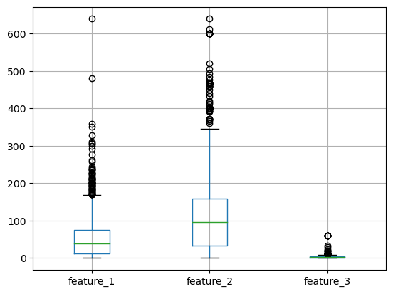
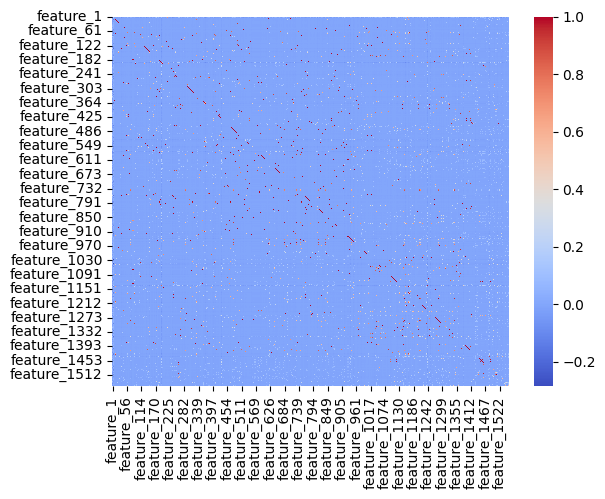
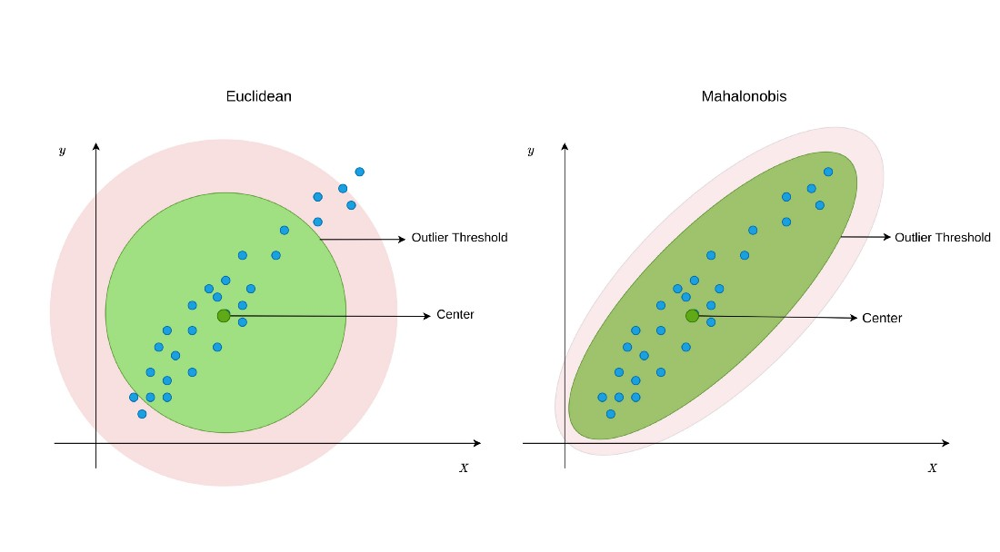
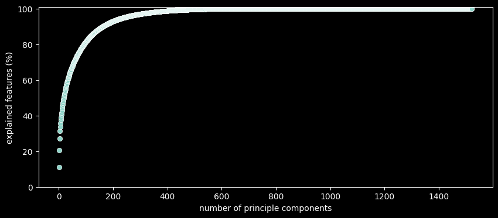
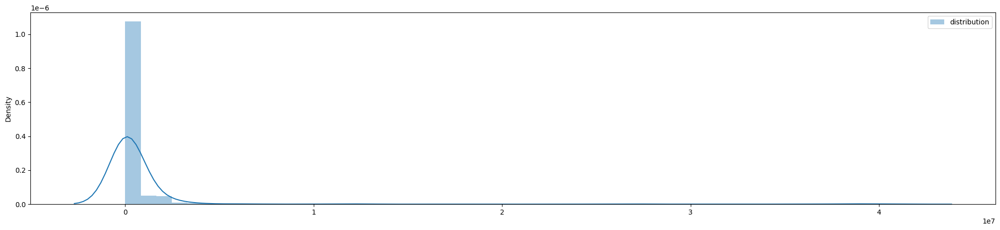
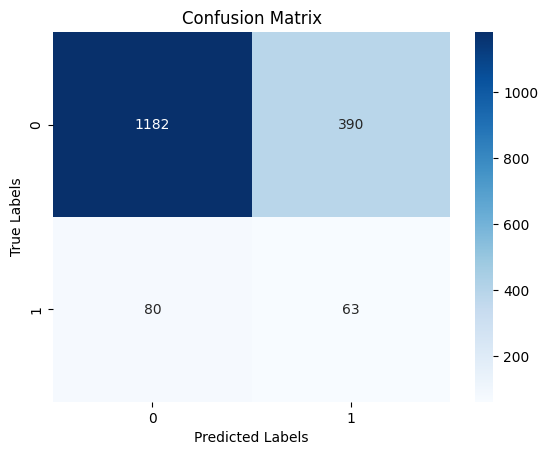

***

# ▶ 센서 데이터를 통한 웨이퍼 불량 탐색 

### - 목적

- 센서 데이터로부터 불량 웨이퍼 패턴을 식별하기 위한 이상 탐지 모델 개발
- 데이터 전처리를 통해 노이즈와 불필요한 정보를 제거하여 분석 효율성 향상
- 공정 센서의 다변량 데이터를 분석하여 결함의 원인을 파악

### - 사용 툴

 

### - 기대효과
- 불량 사전 탐지를 통한 웨이퍼 폐기로, 이후 공정 미투입하여 생산비용 감소 + 해당 공정 집중 관리를 통한 품질 향상

### - 데이터 설명
- 센서 데이터 : 2519 Rows * 1559 Columns
  - Class 0(정상) : Class 1(이상) = 91.7%(1572) : 8.3%(143)
  - Feature 1 ~ 3 숫자형 데이터, Feature 4 ~ 1558 이진 데이터
  
    - Feature1~3의 범위가 크기에, StandardScaling 적용
  - 하나의 값만으로 이루어진 컬럼 제거 후, Correlation Matrix 확인
  

### - 모델링
1. Isolation Forest
	- 차원이 높고 이상치가 적은 데이터셋에 효과적인 트리 기반 비지도 학습 모델
	```
	# Isolation Forest모델링
	X = df_scaled.drop(['Class'], axis=1)
	Y = df_scaled['Class']

	isolation_forest = IsolationForest(contamination=0.08,random_state=23) # 기존 불량률 8%
	isolation_forest.fit(X)

	# 이상치 예측( -1(이상치) → 1, 1(정상치) → 0)
	y_pred = isolation_forest.predict(X)
	y_pred_adjusted = [1 if x == -1 else 0 for x in y_pred]
	  ```

	

	|평가지표|값|
	|---|---|
	|Accuracy|89.68%|
	|Precision|37.68%|
	|**Recall**|**36.36%**|
	|F1 Score|37.01%|

2. PCA + Mahalanobis
	- 다변량 데이터에서 매우 효과적인 모델<br/>
		
	- 200개 PC까지 사용했을 때, 90%정도 분산을 설명할 수 있음<br/>
		
	- Threshold 조정 (하위 75%)<br/>
		
	- Recall 9.8% → 44.1%<br/>
		

		|평가지표|값|
		|---|---|
		|Accuracy|72.59%|
		|Precision|13.91%|
		|**Recall**|**44.01%**|
		|F1 Score|21.14	%|

### - 결론

- Isolation Forest, PCA + Mahalanobis 모델 모두 이상탐지의 주요 지표인 Recall 값이 낮아 현업에서 사용 불가능함
  - 추가적인 하이퍼 파라미터 튜닝 및 Threshold 조정 또는 다른 알고리즘 적용 필요

### - Lesson & Learned
- 문제해결 프로세스
  - 문제 정의 → 기대 효과 → 해결 방안 → 우선 순위 → 분석 → 성과 측정 → 모델 운영
- 이상징후를 신호등 체계로 표현 가능
- Isolation Forest Feature IMP 분석을 통해 어떤 변수에 의해서 이상탐지가 되었는지에 대한 해석이 가능 → 모델에 설명력 확보 가능

***
